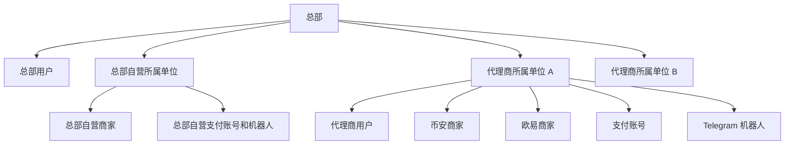
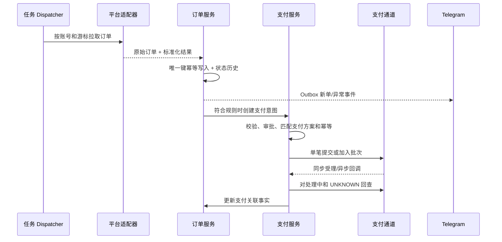
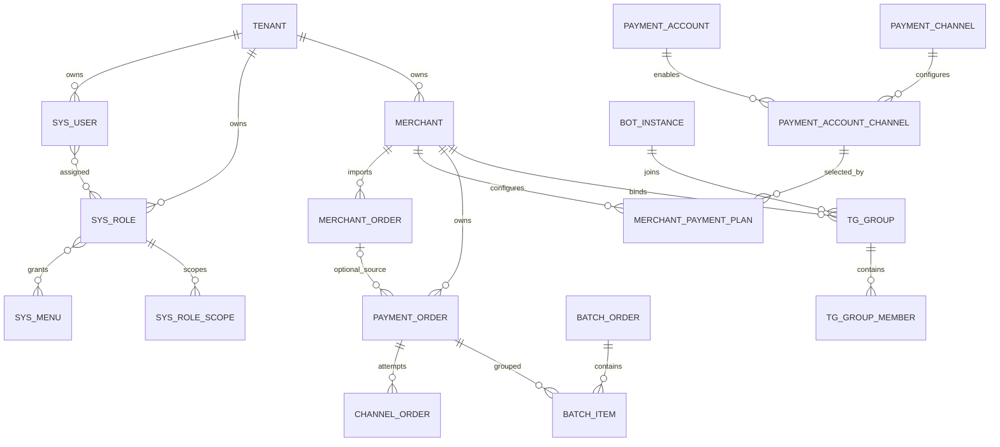

# C2C 商户后台实施需求与系统设计（模板结合版）

> 文档版本：V2.3
> 文档状态：研发基线，已同步业务需求 V3.2
> 更新日期：2026-09-10
> 适用范围：币安、欧易 C2C 买币付款和机器人支付，不包含卖币及终端用户 App 业务

## 1. 模板基线与分析结论

### 1.1 拉取基线

本次仅拉取三个仓库的 `main` 分支：

| 仓库 | 本地目录 | 分支 | 分析提交 |
| --- | --- | --- | --- |
| `sunlightcold/tpl-backend` | `templates/tpl-backend` | `main` | `a8ec0a9dd84eea1f521a631343825544dbc42731` |
| `sunlightcold/tpl-frontend` | `templates/tpl-frontend` | `main` | `9c54d39a6b67be30129655734ee7a3d840e13712` |
| `sunlightcold/pfa-pay` | `templates/pfa-pay` | `main` | `1d862d9dc2dc4027981c26092cb0153270c5ed42` |

目标技术底座采用 `tpl-backend` 的 NestJS、TypeORM、PostgreSQL、Redis、BullMQ 和 `@nestjs/schedule`，以及 `tpl-frontend` 的 Vue 3、TypeScript、Vite、Vben Admin、Pinia、Ant Design Vue 和 VXE Table。`pfa-pay` 是 NestJS、MongoDB/Mongoose、Redis/BullMQ、Telegraf 多应用项目，只作为商家、C2C 与 Telegram 领域流程参考，不迁移其 MongoDB 数据架构。

实际产品代码已导入单一 Git 仓库：后端位于 `projects/backend`，管理后台位于 `projects/admin-web`。`templates/*` 仅保留为临时参考，不属于构建、提交或发布范围，完成参考后删除。

### 1.2 总体结论

1. 复用后台登录、OTP、动态菜单、角色菜单授权、按钮权限、在线会话、操作日志、参数管理和任务管理页面框架。
2. RBAC 当前是单租户设计，不能直接满足所属单位隔离。必须加入所属单位上下文、总部/代理商用户类型和资源数据范围；总部自营使用固定所属单位 ID。
3. 当前权限缓存仅保存权限字符串，角色或用户授权变更后没有完整的即时失效链路。资金系统上线前必须修复。
4. 当前超级管理员按固定 `superAdminUid` 判断，只适合引导账号，不能承担平台与代理商两级权限模型。
5. 当前后台密码使用加盐 MD5，OTP Secret 直接存库，不满足本系统安全要求，必须升级。
6. 任务管理的 BullMQ 调度、执行日志和系统任务注册机制值得复用，但不能向代理商开放 `Service.method` 自由输入。
7. 模板的 App 用户、商品、价格方案、权益、积分、App 交易订单及 App 支付模型全部忽略，C2C 订单与支付领域重新建模。
8. 前端已使用后端动态路由和 `v-access:code` 按钮鉴权，可直接扩展 C2C 菜单和页面；后端仍是最终权限裁决者。

### 1.3 保留、改造和剔除范围

| 分类 | 模板模块 | 处理决定 |
| --- | --- | --- |
| 保留 | `system/auth`、`system/menu`、`system/role`、`system/user` | 保留结构，改造成多租户 RBAC |
| 保留 | `system/task`、任务日志、BullMQ | 保留框架，改为任务注册表和业务任务白名单 |
| 保留 | `system/log`、`system/online`、`system/params` | 增加租户过滤、敏感字段清洗和权限 |
| 保留 | 前端动态路由、权限码、通用表格/表单 | 作为所有新后台页面基础 |
| 可选 | 对象存储、邮件、客户端错误 | 有明确业务用途时保留；不作为 C2C 首期核心依赖 |
| 剔除 | 后端 `apps/admin/modules/app/**` | 整个终端用户 App API 域不接入 C2C 系统 |
| 剔除 | 后端 `apps/admin/database/app/**` | 不复用 App 用户、积分、商品、交易及支付实体 |
| 剔除 | 后端 `modules/system/app/**`、`app-analytics/**`、`commerce/**` | 删除后台对 App 用户和 App 商业模块的管理入口 |
| 剔除 | 前端 `src/views/app/**` | 删除 App 用户、商品、价格方案和 App 交易订单页面 |
| 剔除 | 前端 `app-user.ts`、`app-analytics.ts`、`commerce.ts` | 删除 API 及聚合导出 |
| 重做 | 当前 Dashboard Analytics | 当前依赖 App Analytics，替换为 C2C 经营与任务概览 |

不要因为模板已有 `AppPaymentOrderEntity` 就复用它。其上下文是终端 App 商品交易支付，与 C2C 商家订单、收付款方向、渠道尝试、批次付款和对账的语义不同。

### 1.4 `pfa-pay` 参考评审

#### 可复用的设计思想

- 保留平台无关的 C2C Adapter 与能力矩阵，不同平台客户端独立实现；业务服务只依赖统一契约。
- 使用 `provider + providerAccountId + externalOrderId` 保证外部订单幂等，增量同步使用重叠窗口，并且只有完整分页成功后才推进检查点。
- 资金动作采用条件更新抢占、`SUBMITTING` 超时恢复、主动回查和独立的确认付款/取消/申诉/通知处理流程。
- Telegram 的机器人类型、群能力和成员权限取交集；付款和批次提交默认二次确认；交互上下文有明确状态与 TTL。
- `botCode`、`chatId`、`tgUserId` 和所有外部订单号均使用字符串，避免大整数精度丢失。

#### 必须重构后再采用

| `pfa-pay` 现状 | 目标修正 |
| --- | --- |
| `C2cProviderAccount` 同时保存凭据、同步检查点、Bot/群绑定、消息模板和动作锁 | 商家固定归属一个平台；再拆出凭据版本、同步策略、同步检查点、通知绑定/模板、动作策略和执行租约 |
| C2C 订单混合平台状态、支付、申诉、Telegram 和回复扫描状态 | 拆为订单主表、状态历史、支付订单、渠道尝试、平台动作尝试、申诉和消息投递 |
| `mch_user` 混合商家主体、登录用户、角色与 API 凭据 | 拆为 `tenant`、`merchant`、`sys_user`、角色作用域及独立凭据实体 |
| 所有商家连接由一个任务串行同步 | Dispatcher 按到期商家投递一商家一 Job，增加商家租约、幂等键、重试分类和死信 |
| 商家强制绑定一个 Bot 和一个群 | 商家可绑定零到多个机器人群组，但每个群组只能绑定一个商家和一个支付场景 |
| TG 成员与后台用户无关联，超级管理员可用全局 `*` | TG 身份必须映射有效后台用户；超级管理员只能是本租户全部群或显式群范围 |
| 机器人运行时集中承担命令、支付、申诉、行情和账务 | 拆为 Webhook 接入、命令路由、权限决策、领域 Handler 与队列 Worker |
| 金额及限额使用 JavaScript `number` | PostgreSQL `DECIMAL` 存储、API 字符串传输，并按币种精度校验 |

#### 明确不照搬的问题

- 源码中的 JWT/加密密钥、生产数据库与 Redis 凭据、默认管理员口令属于严重风险；若曾部署必须立即轮换，目标系统禁止任何生产 Secret 入库到 Git。
- 加盐 MD5、明文 OTP Secret、可查询或重置并回显的商家 API Secret、数据库内直接保存 Bot Token 均不接受。
- 未知 Provider 自动回退 Binance、无凭据时默认返回 Binance 能力、申诉文件固定调用 Binance 客户端会造成跨平台误操作，必须使用穷尽式 Provider 路由并对未知值拒绝执行。
- 任意可配置 `apiBaseUrl` 存在 SSRF 风险；目标系统只允许平台预置 HTTPS Origin，上传地址也必须校验协议、DNS/IP 与平台返回的短期签名范围。
- 启动阶段自动迁移明文凭据不可接受；数据迁移必须是可审计、可回滚的离线迁移。
- 商家物理删除并级联删除人员/角色、清零余额会破坏账务与审计，目标系统只允许停用或归档，财务事实永久保留。
- 自动将机器人加入的群设为有效绑定不可接受，必须通过后台发起的一次性挑战或双向人工审批。

关键结论可追溯到以下源码位置，行号以本次分析提交为准，后续更新仓库时需重新评审：

| 证据位置 | 评审结论 |
| --- | --- |
| `server/pay/apps/admin/modules/database/c2c/c2c-provider-account.ts` | 账号实体职责过多，缺少租户边界 |
| `server/pay/apps/admin/modules/c2c/c2c-account.service.ts` | 凭据公开状态计算存在先删除后判断的缺陷，且启动期执行明文迁移 |
| `server/pay/apps/admin/modules/c2c/c2c-provider.client.ts` | 未知平台回退 Binance，上传与能力查询缺少严格 Provider 上下文 |
| `server/pay/apps/admin/modules/c2c/okx-c2c.client.ts` | OKX Cookie 私有端点的字段/流程参考，能力范围尚不完整 |
| `server/pay/apps/admin/modules/c2c/c2c-sync.service.ts` | 全账号串行同步，需要改为账号级队列任务 |
| `server/pay/apps/admin/modules/database/mch/mch-user.ts` | 商家、用户、角色和 API 凭据混合 |
| `server/pay/apps/admin/modules/database/bot/bot-instance.ts` | Bot Token 直接入库，Adapter 使用实现类名称耦合 |
| `server/pay/apps/admin/modules/tg-bot/platform/bot-runtime.service.ts` | 运行时职责过度集中，需拆分命令和领域 Handler |
| `server/pay/apps/admin/modules/tg-bot/platform/bot-platform.service.ts` | 自动绑定群存在越权/误绑定风险 |

#### OKX 私有接口决策

业务明确要求支持 OKX 网页 Cookie 私有接口。该接入作为 `OKX_WEB_PRIVATE` 协议实现，并与官方 API Adapter 隔离；它是高变更、高失效风险能力，不能被描述为官方稳定 API。

- 仅允许商家对其本人或其主体有权使用的 OKX 商户会话进行授权，不提供账号接管、验证码绕过、风控规避或 Cookie 抓取能力。
- 用户通过敏感凭据表单录入 `Cookie` 与 `Authorization`，服务端写入 Secret Manager/KMS；数据库仅保存 Secret 引用、版本、指纹、创建/验证/过期时间和状态，任何查询接口不回显原值。
- 网关固定为平台审核的 `https://www.okx.com` Origin；路径由版本化 Adapter 内部定义，前端不能提交任意 URL、Header 或方法。
- 每次任务读取短期凭据并在内存中使用，日志、APM、错误体、任务详情及原始报文必须清洗 `Cookie`、`Authorization`、设备标识和个人信息。
- 将 401/403、登录页重定向、响应结构改变、验证码/人机校验和平台风控分别分类。会话失效立即停用该凭据并通知人工更新；验证码和风控不得自动绕过。
- 私有端点按接口版本维护响应样本、契约测试和字段映射版本；连续协议错误触发账号级熔断，禁止把空列表误判为无订单并推进同步检查点。
- 能力矩阵按账号与 Adapter 版本返回。当前参考实现仅证明买单列表、详情、反欺诈检查和标记已付款等流程线索，其他能力必须经实际授权账户验证后才启用。
- 上线前由业务、法务、安全共同确认 OKX 条款及使用风险，并准备一键停用、降级人工导入/处理和凭据撤销预案。

## 2. 系统目标与范围

### 2.1 建设目标

- 总部统一管理总部自营和多个代理商；总部自营与代理商可使用相同经营模块。
- 代理商只能访问本所属单位的商家、支付资源、订单、机器人和任务执行记录。
- 商家创建时必须且只能选择一个平台（币安或欧易）；同一经营主体跨平台经营时分别创建商家。
- 每个商家可通过支付方案使用本单位多个支付账号，并配置多个 Telegram 群组；每条方案固定一个账号和该账号下的一个通道。
- 自动同步 C2C 买币订单，并形成商家订单、支付订单、渠道订单和批次订单的完整链路。
- 所有外部调用支持幂等、限频、补偿、回查、对账、告警和审计。
- 敏感配置不可明文回显，资金动作采用最小权限和可选双人复核。

### 2.2 V1 实施范围

- 总部自营、代理商和后台用户管理。
- 多租户 RBAC、动态菜单、按钮权限和数据范围。
- 商家及其唯一币安/欧易平台归属、支付账号、支付通道及绑定配置。
- C2C 买币订单同步、支付订单、渠道订单、批次订单、资金异常和结果未知收口。
- Telegram 机器人实例、群组、成员、超级管理员、四行支付、批次提交、查询、回单、申诉和日报。
- 任务中心、任务日志、操作日志、在线会话、参数及告警。

### 2.3 明确不做

- 终端用户注册、登录、等级、积分、权益、商品、价格方案及 App 订单。
- 除经专项评审的 `OKX_WEB_PRIVATE` 外，不接入非官方接口；任何平台均不提供模拟登录、验证码绕过或风控规避。
- 数字资产钱包、私钥托管和链上充提。
- 未取得官方接口授权的自动付款。
- C2C 卖币订单获取、收款核对、确认到账、放币及对应机器人命令；仅保留订单方向和 Adapter 能力扩展位。

## 3. 多租户与 RBAC 设计

### 3.1 租户模型



- `tenant` 表示所属单位，类型为 `HEADQUARTERS_SELF` 或 `AGENT`；系统初始化时创建唯一且不可删除的总部自营记录。
- 总部用户的身份 `tenantId` 可为空且 `actorType=PLATFORM`，但访问业务数据时必须显式携带获授权的所属单位范围；创建总部自营业务时写入固定总部自营 `tenantId`。
- 代理商用户必须有 `tenantId` 且 `actorType=TENANT`。
- 所有经营业务表必须有非空 `tenantId`，商家资源还必须有 `merchantId`；禁止用空 `tenantId` 表示总部自营业务。
- 代理商“可使用所有功能”指完整业务功能，不包括修改平台级通道定义、系统任务代码、其他代理商数据和平台根角色。

### 3.2 模板 RBAC 的目标改造

| 当前实现 | 问题 | 目标设计 |
| --- | --- | --- |
| `sys_user.username/email` 全局唯一 | 代理商无法独立命名账号 | 改为租户内唯一；平台用户账号使用独立约束或登录名全局规范化 |
| `sys_role.value` 全局唯一 | 无法让每个代理商拥有自己的管理员角色 | 角色增加 `ownerType`、`tenantId`，租户内唯一 |
| `sys_role_menu` 只绑定菜单 | 只有功能权限，没有资源范围 | 增加角色作用域，形成“权限 + 资源范围”授权 |
| JWT 只有 `uid/username` | 服务无法可靠恢复租户上下文 | 加入 `actorType`、`tenantId`、`authzVersion`、`sessionId` |
| 权限缓存为 `uid -> string[]` | 不能表达商家/群组范围，容易缓存陈旧 | 缓存授权快照并版本化，授权变更立即递增版本和撤销会话 |
| 固定 UID 是超级管理员 | 不支持规范的平台角色 | 固定 UID 仅作初始化根账号，运行时按平台角色及权限判断 |
| 角色与菜单状态校验不完整 | 禁用角色可能继续贡献权限 | 计算权限时同时过滤用户、角色和菜单状态 |
| 公共注册接口存在 | 后台账号可被非预期创建 | 生产关闭 `/auth/register`，用户只能由授权管理员创建 |

### 3.3 授权模型

授权结果必须表示为“权限码和数据范围的组合”，不能把权限集合和商家集合分别求并集，否则会发生权限拼接越权。

示例：

```text
角色 A = payment:order:read + 商家 M1
角色 B = payment:order:retry + 商家 M2

正确结果：可读 M1，可重试 M2
错误结果：同时可读和重试 M1、M2
```

后端新增统一授权服务：

```text
authorize(actor, permission, resourceContext)
resourceContext = { tenantId, merchantId?, tgGroupId?, ownerUserId? }
```

控制器继续使用模板的 `@Permission()` 声明动作权限；资源服务在读取或修改前调用统一 Policy/Scope 服务。所有 Repository 查询必须由租户感知的查询入口添加 `tenantId` 条件，禁止依赖前端传入租户 ID。

### 3.4 数据范围

| 范围 | 适用角色 | 说明 |
| --- | --- | --- |
| `PLATFORM_ALL` | 平台管理员/审计员 | 可跨租户，必须具备专用平台权限 |
| `TENANT_ALL` | 代理商管理员 | 本代理商全部商家和群组 |
| `MERCHANT_SPECIFIED` | 运营、财务、商家管理员 | 指定商家集合 |
| `TG_GROUP_SPECIFIED` | TG 管理员/操作员 | 指定群组集合 |
| `SELF` | 普通后台用户 | 仅个人资料、个人会话 |

### 3.5 预置角色

| 角色 | 功能范围 | 数据范围 |
| --- | --- | --- |
| 平台超级管理员 | 全平台配置与应急处置 | `PLATFORM_ALL` |
| 平台运营 | 代理商、商家、订单、任务和告警 | 按授权代理商 |
| 平台审计 | 只读、审计、对账导出 | 按授权代理商 |
| 代理商管理员 | 本租户全部业务模块和用户 | `TENANT_ALL` |
| 代理商运营 | 商家和 C2C 订单处理 | 指定商家或本租户 |
| 代理商财务 | 支付、批次、对账和审核 | 指定商家或本租户 |
| 商家管理员 | 商家账号、订单和绑定资源 | 指定商家 |
| TG 群管理员 | 群成员和群内业务授权 | 指定群组 |
| TG 操作员 | 查询及明确授权的群内操作 | 指定群组 |

### 3.6 权限命名

延续模板的 `模块:资源:动作` 风格：

| 模块 | 核心权限码 |
| --- | --- |
| 代理商 | `agency:tenant:read/create/update/disable`、`agency:user:manage` |
| 商家 | `merchant:account:read/create/update/disable` |
| 商家平台连接 | `merchant:account:test/rotate/sync`；平台类型随商家创建，不提供独立新增权限 |
| 商家订单 | `merchant:order:read/export/sync/resolve` |
| 支付账号 | `payment:account:read/create/update/test/disable/bind` |
| 支付通道 | `payment:channel:read/create/update/disable` |
| 支付订单 | `payment:order:read/create/review/retry/cancel/export` |
| 批次订单 | `payment:batch:read/create/review/submit/retry/export` |
| Telegram | `telegram:bot:*`、`telegram:group:*`、`telegram:member:*`、`telegram:superAdmin:*` |
| 任务 | 保留 `monitor:task:*`、`monitor:taskLog:read`，增加 `monitor:task:operateSystem` |

平台级菜单管理和支付通道定义权限不能授予代理商角色。角色保存时，后端必须校验角色所有者可授予的权限上限，不能只相信前端提交的 `menuIds`。

### 3.7 登录与安全改造

- 后台密码从加盐 MD5 迁移为 Argon2id；登录成功时可渐进升级旧密码哈希。
- OTP Secret、API Secret、Bot Token 和支付私钥使用 KMS/Vault 或信封加密，不直接明文存库。
- 平台管理员和代理商管理员强制 MFA；高风险付款审核可要求近期二次认证。
- JWT 不作为用户状态的唯一事实，每次请求校验会话、用户状态及 `authzVersion`。
- 更新用户状态、角色、菜单、数据范围或密码后，立即清理权限缓存并撤销相关会话。
- 访问令牌数据库只保存不可逆摘要，不保存完整 Bearer Token。
- 前端权限仅控制展示；直接调用 API 仍必须经过后端动作和数据范围校验。

## 4. 功能需求

### 4.1 所属单位管理

- `AG-001` 平台可新增、编辑、启用、停用代理商。
- `AG-001A` 系统初始化唯一且不可删除的总部自营所属单位；总部可在该单位下使用商家、订单、支付、对账和机器人全部经营功能。
- `AG-002` 字段包括代理商编码、名称、主体信息、联系人、时区、默认币种、状态和备注；代理商编码由系统按 `AGT` 前缀自动生成，不提供手工输入。
- `AG-003` 可配置商家数、支付账号数、机器人实例数、后台用户数和任务并发额度。
- `AG-004` 可创建代理商首个管理员并强制首次登录修改密码和绑定 MFA。
- `AG-005` 停用代理商时停止创建新同步和支付任务；处理中付款继续回查，历史数据保留只读。
- `AG-006` 平台用户可切换代理商视角进行只读排障；界面必须持续显示当前代理商并记录审计。

### 4.2 商家与平台归属

- `MER-001` 总部可在总部自营或指定代理商下新增、编辑、启用、停用商家；代理商只能管理本单位商家。创建商家时必须选择 `BINANCE` 或 `OKX`。
- `MER-002` 一个商家必须且只能归属一个平台，不提供新增第二个平台连接的入口。同一经营主体同时经营币安和欧易时，必须分别创建两个商家。
- `MER-002A` 商家编码由系统按 `MCH` 前缀自动生成，不提供手工输入；币安或欧易平台商家编号属于外部标识，由运营人员按平台资料录入。
- `MER-003` 平台类型是商家的固定业务属性，创建后不可修改；若需更换平台，应停用原商家并新建商家，历史订单保留在原商家下。
- `MER-004` 商家平台配置包含外部商户 ID、协议类型、认证模式、凭据引用、Adapter 版本、网络出口策略和同步策略；平台 Origin 由后台白名单选择，不允许自由输入网关。
- `MER-005` 支持连接测试，展示连通、鉴权、权限范围、服务器时钟偏差和限频状态。
- `MER-006` 支持凭据轮换；新凭据验证成功后原子切换，旧版本只在受控回滚窗口可恢复。
- `MER-007` 商家通过支付方案使用本所属单位的多个支付账号；每条方案固定一个账号及该账号下的一个通道，并配置场景、收款方式、即时/批量、币种、金额、顺序、比例和额度。
- `MER-008` 商家可绑定机器人和群组，分别配置通知事件与允许命令。
- `MER-009` 认证模式至少包括 `API_KEY` 与 `WEB_COOKIE`；`WEB_COOKIE` 首期只允许 OKX，必须同时保存 Cookie 与 Authorization 的 Secret 引用和会话健康状态。
- `MER-010` 商家基础资料、凭据版本、同步策略/检查点、通知绑定/模板及高风险动作策略分别管理，禁止聚合到单条商家记录。
- `MER-011` 订单同步可独立启用；至少存在一条合格的 C2C 自动付款方案后才能启用自动付款。无方案时新订单保持 `PENDING_PAYMENT`；人员手工发起支付后仍无方案时支付订单进入 `PENDING_CONFIG`，补充方案后显式重新匹配。

### 4.3 商家订单

- `MO-001` 每个商家独立增量同步买币订单，支持游标、分页、重叠时间窗、断点续传和限频退避；V1 不为卖币订单创建业务记录或待办。
- `MO-002` 唯一键为 `platform + merchantId + externalOrderId`，重复同步只更新允许变化的字段。
- `MO-003` 同时保存平台原始状态、系统标准状态、原始报文密文和状态映射版本。
- `MO-004` 标准字段至少包括买卖方向、法币、数字资产、数量、单价、总额、对手方、付款方式、支付时限和关键时间；方向枚举保留 `SELL`，但对应 Adapter 能力和业务开关默认关闭。
- `MO-005` 支持列表、详情、导出、单笔同步、时间范围补拉、差异处理和完整状态时间线。
- `MO-006` 平台事实状态与本地状态冲突时进入异常队列，不覆盖已经确认的本地资金事实。
- `MO-007` 新单、已付款、临近超时、争议、取消、完成和同步失败可配置通知。
- `MO-008` Adapter 必须明确返回能力矩阵；不支持的动作进入人工处理，未知 Provider 或能力缺失必须拒绝，不能回退到其他平台。
- `MO-009` OKX 私有接口出现会话失效、验证码、风控页或响应契约变化时，当前页及当前轮次整体失败，不推进成功检查点，并触发账号熔断与告警。

V1 买币状态：`NEW`、`PENDING_PAYMENT`、`PAYMENT_PROCESSING`、`PAID_PENDING_PLATFORM_CONFIRM`、`PENDING_RELEASE`、`COMPLETED`、`CANCELLED`、`EXPIRED`、`DISPUTED`、`FUNDS_EXCEPTION`、`EXCEPTION`。卖币不得复用该状态机，后续以独立扩展状态迁移接入。

### 4.4 支付配置

#### 支付通道

- 支付通道按支付宝、微信等支付平台归类。
- 通道描述具体能力，如支付宝批量有密、支付宝商家转账、微信支付。
- 通道配置包括能力类型、单笔/批量、币种、金额范围、时段、费率、限频、回调方式、适配器版本和状态。
- 平台维护通道定义；代理商不能修改适配器和平台级签名规则。

#### 支付账号

- 总部自营和代理商均可在本所属单位新增多个支付账号；每个支付账号只保存一套当前有效凭据，更新时整套覆盖，不建立凭据列表或多套凭据切换。
- 支付账号直接保存可编辑的 API 网关完整地址，支持官方地址、自定义代理网关和本地 Mock，不使用固定正式/沙箱环境枚举。
- 支付宝账号可选择公钥模式或证书模式。公钥模式保存应用 ID、应用私钥和支付宝公钥；证书模式保存应用 ID、应用私钥、应用公钥证书、支付宝公钥证书和支付宝根证书。密钥和证书由本地文件读取后加密保存，所有查询均不回显敏感内容。
- 支付账号编码由系统按 `PAC` 前缀自动生成，不提供手工输入；支付宝商户号属于外部标识，由运营人员按签约资料录入。
- 一个支付账号可同时启用多个支付通道；所有通道共用账号的唯一凭据，每个通道只独立配置优先级、限额、并发、时段和状态。
- 支持连接测试、证书到期检查、渠道权限探测及回调地址展示。
- 支付账号停用后不接新订单，但继续处理原订单回调和查询。

#### 支付方案选择

匹配顺序为：所属单位与商家方案 → 业务场景 → 收款方式 → 即时/批量 → 币种 → 金额 → 时段 → 账号及商家额度 → 账号和通道状态 → 主备顺序。同顺序候选按配置比例分配。结果必须固化为“支付账号 + 该账号下的支付通道”快照。

### 4.5 支付订单与渠道订单

- `PO-001` 支付订单来源为 C2C 买币订单、机器人手工支付或退款申请；保存 `sourceType + sourceBusinessNo`，并与 `tenantId + merchantId` 组成业务唯一约束。退款订单使用独立退款申请号防重，并通过 `originalPaymentOrderId` 关联原成功支付。
- `PO-002` 每次向渠道提交形成独立渠道订单，记录请求号、渠道流水号、状态、脱敏报文和耗时。
- `PO-003` 创建前校验来源业务状态、金额、币种、支付方案、账号与通道归属、额度、风险规则和重复支付。
- `PO-004` 同一业务意图使用稳定幂等键，重复点击、任务重试和网络重试不能产生第二笔资金请求。
- `PO-005` 回调必须验签、防重放，并校验订单号、商户号、金额和币种；主动查询与回调共同推进状态。
- `PO-006` 网络超时进入 `UNKNOWN` 并保持额度占用，只能回查原渠道订单、对账或人工双人确认；最终结果明确前禁止新建付款或换路。
- `PO-007` 支持审核、暂停、仅未提交时取消、回查、明确未受理后的重新匹配、异常处理和对账。
- `PO-008` 正式提交前重新校验权限、来源业务、收款资料、付款时限、账号、通道、余额和额度；C2C 买币订单同时重新读取平台订单。关键资料变化立即停止提交。
- `PO-009` 付款成功后平台确认失败只重试平台确认；自动确认在付款时限内仍未成功时转人工在交易平台确认，再由系统重新同步核实。已付款后订单取消、过期或未放币进入 `FUNDS_EXCEPTION`，通过申诉、退款追踪或人工处理收口。
- `PO-010` 退款关联原成功支付，累计成功与处理中退款不得超过原付款；退款执行相同的幂等、审核、回查和对账规则。
- `PO-011` 未提交支付取消或审核拒绝时释放额度。C2C 来源仍有效时复用原支付订单恢复；机器人手工支付作废后原商户订单号不得再用；退款使用新申请号再次发起。

支付订单状态：`PENDING_CONFIG`、`PENDING_REVIEW`、`QUEUED`、`SUBMITTING`、`PROCESSING`、`SUCCESS`、`FAILED`、`UNKNOWN`、`CANCELLED`、`REFUNDED`、`EXCEPTION`。

### 4.6 批次订单

- `BO-001` 按所属单位、商家、支付账号、通道、币种、业务日期和批次上限聚合支付订单，任一维度不同不得进入同一批次。
- `BO-002` 批次主单记录总笔数、总金额、成功/失败/处理中笔数、渠道批次号和状态。
- `BO-003` 批次明细关联支付订单和渠道订单；一笔明细同一时刻只能属于一个有效提交批次。
- `BO-004` 组批时锁定明细，提交前再次校验权限、来源业务、收款资料、付款时限、账号、通道、余额、额度、状态、笔数和总金额，提交使用批次幂等键。
- `BO-005` 支持手工/定时组批、审核、提交、回查、下载结果及仅重试明确失败的明细。
- `BO-006` 仍有处理中明细时为 `PROCESSING`，存在未知明细时为 `UNKNOWN`；只有全部明细终结且成功、失败并存时才为 `PARTIAL_SUCCESS`。仅明确失败、确认未扣款且仍可付款的明细可重新组批。
- `BO-007` 预计不能在 C2C 付款时限前完成组批且尚未提交时，释放原批量方案占用，将执行方式改为即时，重新匹配即时方案并重新审核；没有即时方案则进入人工待办，由人员在截止前补充即时方案并在系统内完成支付，或者停止付款。
- `BO-008` 批次审核拒绝或提交前取消时解锁明细，仍有效的明细返回 `QUEUED`，已失效明细退出批次并进入对应状态。

### 4.7 Telegram 机器人

- `TG-001` 总部自营和代理商均可在本所属单位新增多个机器人实例，配置 Bot Token、Webhook Secret、Webhook 地址、语言和状态。
- `TG-001A` 机器人编码由系统按 `BOT` 前缀自动生成，不提供手工输入；Telegram User ID 和 Chat ID 属于外部标识，按 Telegram 实际数据录入或回写。
- `TG-002` 机器人加入群后使用一次性验证码绑定，不能只凭 Chat ID 完成绑定。
- `TG-003` V1 一个群必须且只能绑定一个商家和一个支付场景，不预留可直接启用的多对多开关。
- `TG-004` 群成员保存 Telegram User ID，并映射有效后台用户。
- `TG-005` 群内角色包括管理员、操作员和只读；权限由后台授予，不直接继承 Telegram 群管理员身份。
- `TG-006` TG 超级管理员可选择本租户全部群或指定群；“全部群”包含未来新增群，但绝不跨租户。
- `TG-007` Telegram Update ID 幂等处理，命令结果关联后台审计和业务请求 ID。
- `TG-008` V1 支持四行支付、批次提交、查询、余额、回单、统计、C2C 买币支付、申诉和日报；创建订单和提交批次的二次确认由机器人配置。卖币收款和放币命令不开放。
- `TG-009` Bot Token 只保存 Secret 引用；优先使用 Webhook 加队列处理。若采用长轮询，必须独立于后台 API 进程并通过租约保证单实例消费。
- `TG-010` 高风险操作在提交和确认两个时点分别重新鉴权；用户、角色、群绑定或后台账号已失效时，即使已有交互上下文也必须拒绝。
- `TG-011` 多笔四行支付逐笔解析和校验，错误项单独返回原因，正确项继续确认；机器人批次只能汇总当前群组绑定商家的订单，并遵守批次隔离规则。

## 5. 基于模板的任务管理设计

### 5.1 可复用能力

模板已具备：

- `sys_task`、`sys_task_log` 实体。
- BullMQ 重复任务的创建、启动、停止和立即执行。
- Cron 与 Interval 两种调度方式。
- `system/custom` 任务来源和系统任务注册表。
- 任务列表、任务日志页面及 `monitor:task:*` 权限。

### 5.2 必须改造的问题

1. 前端当前允许输入 `Service.method` 和任意字符串参数，不允许在生产租户界面继续开放。
2. `@ScheduleTask()` 标记在类上时，类的其他公开方法也可能被字符串调用；目标实现改为方法级任务注册或显式任务处理器 Map。
3. 当前时区固定为 `Asia/Shanghai`；系统任务使用 UTC，业务日切任务明确记录业务时区。
4. 当前日志只有成功/失败、耗时和文本详情，缺少租户、商家、目标账号、尝试次数、错误码和运行 ID。
5. 当前没有业务级并发策略、超时、租约、死信和重试分类。
6. 系统任务前端完全禁用操作，不满足平台运维的受控暂停、恢复和手动触发需求。

### 5.3 目标任务模型

任务分三层：

| 层级 | 作用 | 管理方式 |
| --- | --- | --- |
| 任务定义 | 定义可执行代码、默认计划和参数 Schema | 代码注册，平台不可修改处理器 |
| 调度策略 | 定义全局扫描周期或租户同步策略 | 平台配置；代理商只配置本租户允许项 |
| 任务实例 | 一次具体执行，携带租户和资源上下文 | 系统生成，不允许手工伪造上下文 |

任务定义使用稳定 `taskCode`，由服务端注册表映射处理器，不接收客户端传入的 `service`：

| `taskCode` | 用途 | 建议默认策略 |
| --- | --- | --- |
| `C2C_ORDER_SYNC_DISPATCH` | 扫描到期商家并派发同步 | 每 10 秒 |
| `C2C_ORDER_SYNC` | 同步单个商家的一个时间窗 | Dispatcher 派发，一商家一 Job |
| `C2C_ORDER_COMPENSATE` | 重叠窗口补偿与状态核对 | 每 5 分钟 |
| `PAYMENT_STATUS_QUERY` | 回查处理中/未知支付 | 每 30 秒 |
| `BATCH_STATUS_QUERY` | 回查批次及明细结果 | 每 60 秒 |
| `PAYMENT_RECONCILIATION` | 下载账单并对账 | 每日按支付账号时区 |
| `TG_DELIVERY_RETRY` | 重试可恢复的消息发送 | 每分钟 |
| `CREDENTIAL_EXPIRY_CHECK` | 检查证书和凭据有效期 | 每日 |
| `OKX_SESSION_HEALTH_CHECK` | 校验 Cookie 会话与响应契约 | 按账号低频执行，失败熔断 |
| `AUDIT_RETENTION` | 归档到期日志 | 每日，平台级 |

任务实例数据由服务端生成：

```json
{
  "runId": "uuid",
  "taskCode": "C2C_ORDER_SYNC",
  "tenantId": "uuid",
  "merchantId": "uuid",
  "resourceType": "MERCHANT",
  "resourceId": "uuid",
  "windowStart": "ISO-8601",
  "windowEnd": "ISO-8601",
  "triggerType": "SCHEDULED"
}
```

### 5.4 调度与执行规则

- Dispatcher 只查找需要执行的商家并投递短任务，不在一个 Cron 中串行处理全部代理商。
- Job ID 使用 `taskCode + resourceId + timeBucket`，防止同一时间窗重复投递。
- 每个商家使用数据库租约或 Redis 分布式锁控制并发；锁必须有租期和所有者校验。
- 业务处理器必须幂等，锁只用于降低并发，不作为唯一正确性保证。
- 429、网络错误、5xx 使用指数退避加抖动；认证失败、签名失败和参数错误不盲目重试。
- OKX 401/403、登录页重定向或凭据失效不重试并标记 `CREDENTIAL_INVALID`；验证码/风控返回 `MANUAL_ACTION_REQUIRED`；响应契约变化返回 `PROTOCOL_CHANGED` 并熔断。
- 达到最大重试进入死信/异常队列并告警，可由有权限人员在修复原因后重新投递。
- 停止调度不等于取消正在执行的付款；资金任务必须完成或进入可回查状态。
- 平台运维可暂停/恢复/立即触发系统任务，但不能改处理器；代理商只能触发自己账号的业务动作。

### 5.5 任务日志

扩展任务日志字段：`runId`、`jobId`、`taskCode`、`tenantId`、`merchantId`、`resourceType`、`resourceId`、`triggerType`、`attempt`、`queuedAt`、`startedAt`、`endedAt`、`status`、`errorCode`、`detailSanitized`、`metricsJson`。

状态扩展为：`QUEUED`、`RUNNING`、`SUCCESS`、`FAILED`、`PARTIAL`、`SKIPPED`、`CANCELLED`、`DEAD_LETTER`。日志正文禁止包含秘钥、完整账号和外部原始敏感报文。

### 5.6 任务中心页面

- 平台视图：全部任务定义、调度状态、队列深度、最近结果、失败率、P95 耗时和跨租户筛选。
- 代理商视图：本租户商家同步状态、最近运行、失败原因和手工同步入口。
- 任务日志：按任务码、租户、商家、资源、状态、触发方式和时间筛选。
- 系统任务只显示“暂停、恢复、立即执行、查看日志”，不显示处理器输入框。
- 业务同步入口放在商家详情和订单页面，仍复用统一任务执行链路。

## 6. 订单同步与支付流程



外部原始报文先安全落库，再标准化。外部请求超时只能表示“结果未知”，不得当成失败直接再次支付。

## 7. 数据模型

### 7.1 RBAC 表改造

| 表 | 改造 |
| --- | --- |
| `sys_user` | 增加 `actorType`、`tenantId`、`authzVersion`、`passwordAlgo`；调整唯一约束 |
| `sys_role` | 增加 `ownerType`、`tenantId`、`systemLocked`；租户内角色编码唯一 |
| `sys_role_menu` | 保留功能权限关系 |
| `sys_role_scope` | 新增，保存角色对应的租户/商家/群组范围 |
| `sys_access_token` | 增加会话 ID 和令牌摘要，移除完整 Token 存储 |
| `sys_menu` | 保持全局代码注册表，剔除 App 菜单并注册 C2C 菜单 |

### 7.2 业务表

| 领域 | 主要表 |
| --- | --- |
| 所属单位 | `tenant`（类型为总部自营或代理商）、`tenant_quota` |
| 商家 | `merchant`（含唯一平台类型与外部商户 ID）、`merchant_credential_version`、`merchant_sync_policy`、`sync_checkpoint` |
| C2C 订单 | `merchant_order`、`merchant_order_status_history`、`order_sync_record`、`platform_action_attempt`、`order_appeal` |
| 支付配置 | `payment_platform`、`payment_channel`、`payment_account`、`payment_account_channel`、`merchant_payment_plan` |
| 支付执行 | `payment_order`（含来源类型和原业务编号）、`channel_order`、`payment_callback_event` |
| 批次 | `batch_order`、`batch_item` |
| 对账 | `reconciliation_batch`、`reconciliation_difference` |
| 通知配置 | `notification_binding`、`notification_template`、`notification_delivery` |
| Telegram | `bot_instance`、`tg_group`（直接保存唯一 `merchantId` 和支付场景）、`tg_group_member`、`tg_super_admin_scope`、`tg_update_event`、`tg_interaction_context` |
| 可靠事件 | `outbox_event`、`alert_event` |

所有经营业务表必须包含非空 `tenantId`，总部自营业务写入固定总部自营 ID。常用唯一约束必须把 `tenantId` 或明确的全局外部标识纳入。`merchant.platform` 非空且创建后不可修改，每个 `merchant` 只有一组当前有效的平台连接。金额使用 `DECIMAL`，时间以 UTC 的 `timestamptz` 存储，外部 ID 使用字符串。`merchant_credential_version` 只保存 Secret 引用和元数据，不保存可直接使用的 Cookie、Authorization、API Secret 或 Bot Token 明文。

### 7.3 核心关系



## 8. 后端落地结构

### 8.1 保留并改造

```text
server/backend/apps/admin/
├── modules/system/auth       # JWT、登录、OTP、全局 Guard
├── modules/system/user       # 平台/代理商后台用户
├── modules/system/role       # 多租户角色和授权范围
├── modules/system/menu       # 代码注册菜单与权限节点
├── modules/system/task       # BullMQ 任务定义、调度和运行
├── modules/system/log        # 操作日志、任务日志
├── modules/system/online     # 会话查询与撤销
├── modules/system/params     # 平台级参数；租户参数另建表
├── modules/cache
├── modules/bullmq
└── database/migrations
```

### 8.2 新增业务模块

```text
server/backend/apps/admin/modules/
├── agency/
│   ├── tenant
│   └── tenant-user
├── merchant/
│   ├── merchant
│   ├── order
│   └── sync
├── payment-center/
│   ├── platform
│   ├── channel
│   ├── account
│   ├── routing
│   ├── payment-order
│   ├── batch-order
│   ├── webhook
│   └── reconciliation
├── telegram/
│   ├── bot
│   ├── group
│   ├── member
│   └── webhook
└── alert/
```

外部平台接入采用适配器接口：

```text
C2cPlatformAdapter:
  getCapabilities, testConnection, listOrders, getOrder,
  mapOrder, getRateLimitState, classifyError

PaymentChannelAdapter:
  testConnection, createPayment, queryPayment,
  createBatch, queryBatch, verifyAndParseWebhook, downloadStatement
```

适配器只负责协议、签名和字段转换；租户校验、订单状态机、路由、额度、审批与幂等留在领域服务。

Provider 解析使用穷尽式注册表，例如 `BINANCE_OFFICIAL -> BinanceOfficialAdapter`、`OKX_WEB_PRIVATE -> OkxWebPrivateAdapter`。每个动作必须携带 Provider 上下文，包括文件上传；不存在 Adapter 或能力为 false 时返回稳定的 `UNSUPPORTED_CAPABILITY`，绝不默认使用 Binance。

`OkxWebPrivateAdapter` 运行在独立 Worker 队列与受限网络出口中，仅能访问白名单 Origin 和固定路径。它不能自行登录或刷新会话；收到新 Cookie 只能来自有权限用户的显式凭据轮换操作。

### 8.3 App 模块清理

从 `AppModule` 和 `SystemModule` 移除 `ClientAppModule`、`AppAdminModule`、`AppAnalyticsModule` 和 `CommerceModule`；从 `DatabaseModule` 移除全部 `appEntities`。后台 JWT 服务去掉 `AppUserEntity`、App Token 和 `/v1/app` 路由特判。

如果项目使用全新数据库，可直接以不含 App 表的 C2C 基线迁移初始化。如果已有模板数据库执行过旧迁移，不能修改已执行迁移历史；先停止引用，再通过单独 contract 迁移和运维确认清理 App 表。

### 8.4 数据库迁移要求

遵守模板规则：生产和开发均保持 `synchronize: false`；所有 Entity 变更同时增加 TypeORM migration，并登记到 `server/backend/apps/admin/database/migrations/index.ts`。

建议迁移顺序：

1. `c2c-tenant-rbac`：总部自营固定所属单位、代理商、多租户用户/角色和数据范围。
2. `c2c-merchant-platform`：商家唯一平台归属、凭据和同步检查点。
3. `c2c-payment-config`：支付平台、通道、账号、商家支付方案和额度占用。
4. `c2c-order-center`：买币商家订单、来源可区分的支付订单、渠道订单、批次、退款、资金异常和状态历史。
5. `c2c-telegram`：机器人、群组、成员和 Update 防重。
6. `c2c-task-observability`：任务定义、运行实例和扩展日志。

每项迁移需覆盖首次执行、结构校验和已执行版本跳过测试；破坏性清理使用 expand-contract 分阶段完成。

## 9. 前端落地结构

### 9.1 复用能力

- `src/router/access.ts` 的后端菜单生成方式。
- `src/store/auth.ts`、Access Store 和 `v-access:code`。
- `views/system/user|role|menu` 的表格、表单和角色树交互。
- `views/monitor/task|task-log|log|online` 的管理界面。
- 通用 `useResourceGrid`、`useFormModal` 和 API Request Client。

`authStore.setAccessCodes()` 当前会额外调用获取 OTP URL 的接口，应删除这一无关副作用；OTP URL 只在绑定 OTP 页面请求。

### 9.2 删除项

```text
apps/frontend/src/views/app/**
apps/frontend/src/api/system/app-user.ts
apps/frontend/src/api/system/app-analytics.ts
apps/frontend/src/api/system/commerce.ts
```

同时删除对应 API 聚合导出和 `default-admin-menus.ts` 中的 `appManagement` 全部菜单。当前 Dashboard 依赖 App Analytics，需替换而不是原样保留。

### 9.3 新增页面

```text
views/
├── dashboard/c2c-overview
├── agency/tenants
├── agency/users
├── merchant/accounts
├── merchant/orders
├── payment/accounts
├── payment/channels
├── payment/orders
├── payment/batches
├── payment/reconciliation
├── telegram/bots
├── telegram/groups
├── telegram/members
└── telegram/super-admins
```

商家新增页必须先选择币安或欧易，并在同一流程中填写对应连接资料；不提供独立新增平台账号页面。订单详情使用概览、状态时间线、支付关联、批次、同步记录、通知和审计标签页。列表页支持保存筛选、固定关键列和权限化导出。秘钥输入只支持覆盖更新，不回填原值。

新建欧易商家并选择 `OKX_WEB_PRIVATE` 后，表单显示独立的敏感凭据编辑器：Cookie、Authorization 只可覆盖录入；普通用户仅看到“已配置”、指纹后 6 位、凭据版本、最后验证时间、预计/检测失效时间和健康状态。商家详情展示 `HEALTHY`、`EXPIRING`、`INVALID`、`RISK_CHALLENGE`、`PROTOCOL_CHANGED`、`CIRCUIT_OPEN` 状态，以及“连接测试、轮换凭据、暂停同步、恢复同步、查看脱敏诊断”操作。

## 10. 后台 API 约定

- 延续模板 `/auth/*` 与 `/sys/*` 路径体系；新业务资源放在 `/sys` 下。
- 写操作使用 `Idempotency-Key` 和 `X-Request-Id`。
- 金额以字符串传输；时间使用带时区 ISO-8601。
- 更新资源使用版本号乐观锁，冲突返回 HTTP 409。
- 错误响应包含稳定错误码、可读消息和请求 ID，不返回底层异常或秘钥。
- 凭据创建/轮换只在成功响应中一次性返回必要的生成值；列表、详情、导出和连接测试永不返回 Secret 原文。

主要接口：

| 资源 | 接口示例 |
| --- | --- |
| 代理商 | `POST /sys/tenants`、`PATCH /sys/tenants/{id}/status` |
| 商家 | `POST /sys/merchants`、`GET /sys/merchants/filter`、`POST /sys/merchants/{id}/test-connection`、`POST .../{id}/rotate-credential` |
| 商家订单 | `GET /sys/merchant-orders/filter`、`POST /sys/merchant-orders/sync` |
| 支付账号 | `POST /sys/payment-accounts`、`PUT .../{id}/credential`、`POST .../{id}/channels` |
| 支付订单 | `POST /sys/payment-orders`、`PUT .../{id}/review`、`PUT .../{id}/retry` |
| 批次 | `POST /sys/payment-batches`、`PUT .../{id}/submit`、`PUT .../{id}/refresh` |
| Telegram | `POST /sys/tg/bots`、`POST /sys/tg/groups/bind` |
| 任务 | 保留 `/sys/tasks` 和 `/sys/logs/task/filter`，补充系统任务运维接口 |

## 11. 安全与可靠性

- 支付账号的唯一凭据使用平台凭据主密钥加密保存；其他外部凭据可保存 Secret Manager 引用和版本元数据。日志及导出中禁止出现任何凭据明文或密文。
- 应用加密主密钥、JWT Secret、数据库/Redis 密码和默认管理员口令不得硬编码；密码使用 Argon2id，OTP Secret 使用 KMS 信封加密，访问令牌仅保存摘要。
- Cookie/Authorization 采用独立 Secret、最小权限读取和版本轮换；解密操作记录审计但绝不记录明文，Worker 内存使用后不得落盘或进入异常对象。
- 外部 HTTP 客户端禁用任意重定向，校验 HTTPS、Host、解析后的公网 IP 和端口；API Origin 使用只读白名单，防止 SSRF 和 DNS Rebinding。
- Webhook 使用 HTTPS、原始请求体验签、时间戳/随机数防重放和事件唯一键防重。
- 回调先持久化再异步处理；金额、币种、商户号和订单号全部匹配后才推进业务状态。
- 商家订单和支付状态迁移在事务内同时写状态历史与 Outbox。
- 支付创建对 `merchantOrderId + businessIntent` 建唯一约束。
- `UNKNOWN` 订单始终使用原外部请求号回查，不能自动换通道重付。
- 导出要求权限、原因、水印、数量上限和短期下载有效期。
- 审计日志只追加，记录租户、操作者、对象、变更摘要、IP、请求 ID 和结果。

## 12. 非功能指标

| 类别 | V1 目标 |
| --- | --- |
| 可用性 | 核心后台和订单服务月可用性 99.9%，不含外部平台故障 |
| 同步时效 | 外部 API 正常时，95% 新订单在 60 秒内入库 |
| 查询性能 | 常用列表 P95 小于 2 秒，详情 P95 小于 1 秒 |
| Webhook | 接收 P95 小于 500ms，业务异步处理 |
| 容量基线 | 100 个代理商、1,000 个商家、日订单 100 万，上线前压测校准 |
| 恢复目标 | 建议 RPO 5 分钟、RTO 30 分钟 |
| 可观测性 | 日志、指标和追踪关联 requestId、tenantId、orderId、runId |

## 13. 验收与测试

### 13.1 RBAC

1. 代理商 A 通过列表、详情、导出、WebSocket、任务日志和 Telegram 均不能访问代理商 B 数据。
2. 角色 A/B 的权限与商家范围不会发生交叉拼接越权。
3. 禁用用户/角色或调整授权后，旧权限缓存和会话立即失效。
4. 代理商管理员无法授予平台权限或把范围扩大到其他租户。
5. 直接绕过前端调用 API 仍被后端拒绝。
6. 创建商家时必须选择币安或欧易；创建后追加第二个平台或修改平台类型的请求均被拒绝。
7. 同一经营主体分别创建币安商家和欧易商家后，两者的凭据、订单、同步检查点和任务上下文完全隔离。
8. 总部自营的商家、支付账号、订单、机器人和任务均写入固定且非空的总部自营 `tenantId`；总部可经营，代理商不可读取。

### 13.2 任务中心

1. 客户端不能提交任意 `Service.method` 或伪造 `tenantId` 执行任务。
2. 同一账号同一时间窗重复投递只执行一个有效任务。
3. 任务进程崩溃后租约可恢复，检查点未越过未完成分页。
4. 认证失败不无限重试，429 和网络错误按策略退避，死信产生告警。
5. 平台暂停调度后不创建新任务，但已提交支付仍可安全回查。

### 13.3 订单与支付

1. 同一外部订单重复返回 100 次，本地仍只有一条订单。
2. 旧平台响应不能回退本地已保存的新状态。
3. 重复提交同一支付幂等键不能产生第二笔渠道付款。
4. 正式提交前平台订单取消、过期或收款资料变化时不付款，并释放已占用额度。
5. 网络超时进入未知状态并保持额度占用，通过原渠道回查、对账或人工双人复核终结，明确失败前无法重新付款。
6. 付款成功但平台确认失败时只重试平台确认；已付款后订单取消、过期或未放币进入资金异常。
7. 批次总金额等于有效明细合计；不同所属单位、商家、账号、通道或币种不混批；存在处理中或未知明细时不能标记部分成功。
8. 对账能识别本地单边、渠道单边、金额不符和状态不符，并在明确更新订单、额度和资金结论后关闭差异。
9. 退款累计成功金额与处理中金额不超过原付款金额，重复请求不产生第二次退款。
10. 同步返回卖币订单时 V1 不创建本地业务单、待办或自动任务，后台和机器人无收款、放币入口。

### 13.4 OKX 私有接口与 Telegram

1. OKX Cookie 与 Authorization 在创建后不可通过任何查询、错误、日志、追踪、导出和任务详情取回；轮换后旧版本立即停止用于新任务。
2. OKX 401/403、登录页、验证码/风控页及响应结构变化分别产生稳定错误码，均不推进同步检查点；连续协议错误触发账号级熔断。
3. 用户输入任意 Host、重定向至非白名单域名、DNS 解析到内网地址及非 HTTPS 上传地址均被拒绝。
4. 未知 Provider、不支持动作及 OKX 申诉上传不能调用 Binance 客户端，能力矩阵不得在缺少账号上下文时猜测默认平台。
5. 同一账号的定时同步、手工同步和补偿任务并发时只有一个租约持有者执行，其他任务幂等跳过或等待。
6. 停用后台用户、移除群范围或禁用机器人后，已有 Telegram 交互在最终确认时也被拒绝；超级管理员不能跨租户访问群。
7. 未完成一次性挑战/人工审批的 Telegram 群不能自动激活，Bot Token 不出现在数据库明文字段。
8. 多笔四行支付中错误项独立返回、正确项继续；同一商户订单号重复提交只返回原支付订单。
9. 机器人批次只能包含当前群组绑定商家的订单，并按完整批次隔离维度拆分。

### 13.5 必跑验证

后端至少执行：`pnpm run lint:server`、`pnpm run typecheck:server`、`pnpm run test:server`、`pnpm --filter ./server/backend run test:integration`、`pnpm run build` 和迁移链验证。

前端至少执行：lint、typecheck、单元测试和生产构建；使用不同角色进行动态菜单、按钮权限、深链接和 403 回归测试。

## 14. 实施顺序

### 第一阶段：模板瘦身与安全基线

剔除 App 域，替换 Dashboard；升级密码与 Token 存储；关闭后台公开注册；建立 C2C 菜单注册表和迁移基线。

### 第二阶段：多租户 RBAC

完成总部自营固定所属单位、代理商、总部/租户用户、角色权限、资源范围、授权缓存失效和租户越权自动化测试。

### 第三阶段：商家与订单同步

完成商家唯一平台归属、凭据、适配器、买币订单任务 Dispatcher、增量同步、补偿和订单查询。卖币能力保持关闭。先完成 Binance 正式 API，再在独立 Worker 中接入 `OKX_WEB_PRIVATE`；OKX 必须通过脱敏契约样本、授权测试账号、小流量灰度和熔断演练。

### 第四阶段：支付与批次

完成支付方案、单笔、回调、回查、结果未知收口、平台确认重试、资金异常、退款、批次、对账和异常工作台；通过小额生产验证后逐步开放自动化。

### 第五阶段：Telegram 与运营

完成机器人、群组、成员权限、通知和受控命令，并完善告警、容量、备份恢复和应急演练。

## 15. 开发前必须确认的外部条件和运营参数

1. 币安商户类型、官方 API 文档版本、测试环境、订单字段、限频与 Webhook 能力。
2. OKX 私有端点的已验证路径/字段样本、必须支持的动作、Cookie 有效期、Authorization 形式、限频、风控响应和允许使用该接入的业务/合规确认。
3. “支付宝批量有密”的正式产品名称、签约主体、证书模式和批次限制。
4. 自动付款、机器人付款、退款和人工资金终结的审核金额及双人复核阈值。
5. 对账单来源、手续费规则、业务日切时区和数据保留期。
6. Telegram 最终展示的命令名称和按钮文案。
7. 是否使用全新数据库；本文档建议全新 C2C 数据库，不迁移模板 App 数据。

已确定且不得在实施时重新解释的业务边界：V1 只处理买币付款；总部自营与代理商经营功能一致；资源不得跨所属单位；每个群组只绑定一个商家；支付方案固定一个账号和该账号下的一个通道；机器人支付、退款、防重、结果未知和资金异常按业务需求 V3.2 执行。卖币必须经过后续专项需求、状态机和迁移评审后才能启用。

## 16. 上线门槛

- Binance 等正式接口通过沙箱或小额生产验证；OKX 私有接口通过授权测试账号与小流量灰度验证，并形成账号级、Adapter 版本级能力矩阵。
- 完成租户越权、权限拼接、Webhook 重放、日志泄密、秘钥轮换和依赖漏洞测试。
- 完成重复消息、乱序回调、请求超时、部分成功、限频、平台宕机和 Worker 崩溃测试。
- 完成 OKX Cookie 失效、验证码/风控、HTML 登录页、JSON 契约变化、重定向、SSRF、凭据泄露扫描和一键熔断演练。
- 完成对账、人工异常处理、备份恢复、停付开关、告警值班和应急演练。
- 业务、技术、安全、财务及合规共同签署上线检查表。
