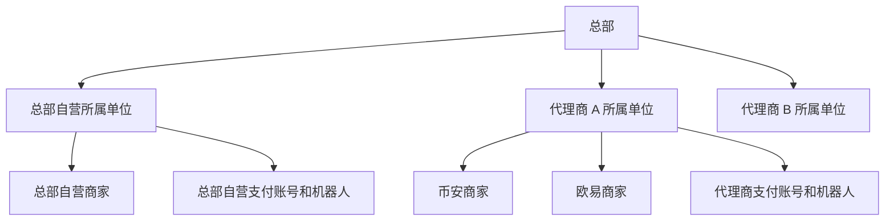
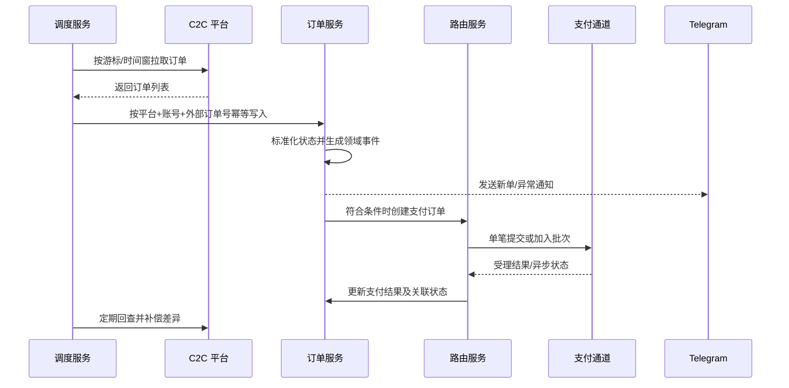
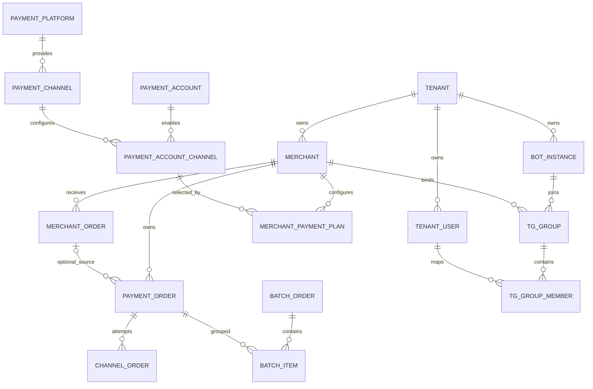
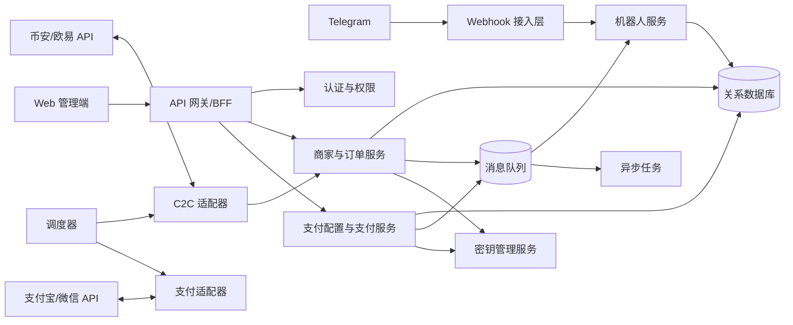

# 币安、欧易 C2C 商户后台管理系统需求与设计

> 文档版本：V1.3
> 文档状态：需求基线（已同步老板版 V3.2）
> 更新日期：2026-09-10
> 目标读者：产品、研发、测试、运维、安全、财务与合规人员

## 1. 文档目的

本文档定义一个面向币安（Binance）、欧易（OKX）C2C/P2P 商家的多所属单位后台管理系统。总部既管理代理商，也通过系统固定的“总部自营”所属单位直接经营商家、支付账号、订单、支付和 Telegram 机器人。系统提供权限隔离、审计、告警、对账及运营能力。

本文档既是产品需求基线，也是后端、前端、测试和部署设计的输入。官方接口的名称、签名规则、限频和可用能力必须在开发前以各平台届时提供的官方商户 API 文档为准；业务确认必须支持的 OKX 网页 Cookie 私有接口按 `OKX_WEB_PRIVATE` 受控协议实施，不得被描述为官方稳定 API。

## 2. 建设目标与边界

### 2.1 建设目标

1. 一个后台统一管理总部自营、多个代理商及多个币安/欧易商家；每个商家只归属一个所属单位和一个 C2C 平台。
2. 自动同步商家 C2C 订单，保证不重单、不漏单、可补偿、可追溯。
3. 将 C2C 订单与支付订单、渠道订单、批次订单建立完整关联。
4. 支付账号可同时开启多个支付通道，商家通过支付方案选择、限额和备用顺序使用。
5. 通过 Telegram 群组完成通知和受控操作，所有敏感操作均可鉴权和审计。
6. 总部自营与代理商拥有同一套经营功能；代理商只能访问本代理商数据，总部按授权管理全部所属单位。
7. 秘钥、资金操作及订单状态变更满足最小权限、加密、幂等、双重校验和审计要求。

### 2.2 V1 范围

- 总部自营、代理商和后台用户管理。
- 币安、欧易商家账号及 C2C API 接入配置。
- OKX 网页 Cookie 私有接口的受控接入、会话健康检查和失效熔断。
- C2C 买币订单增量同步、查询、详情、异常处理和人工补单。
- 支付账号、支付平台、支付通道及商家支付方案配置。
- 单笔支付订单、渠道提交记录、批次订单及批次明细管理。
- Telegram 机器人实例、群组、成员、角色和通知模板管理。
- 机器人四行支付、C2C 买币订单支付、批次提交、查询、回单、申诉和日报。
- 多租户权限、操作审计、任务监控、告警和基础对账。

### 2.3 暂不纳入 V1

- C2C 广告刊登、自动调价、库存和盘口策略。
- 数字资产托管、链上充提和钱包私钥管理。
- 除 `OKX_WEB_PRIVATE` 固定协议外的非官方接口抓取，以及任何模拟登录、验证码绕过或规避平台风控的能力。
- 会计总账、税务申报及完整财务 ERP。
- C2C 卖币订单获取、收款核对、确认到账、放币及对应机器人命令；数据模型和平台能力接口仅保留扩展位置。
- 仅依据 Telegram 指令或截图确认资金结果。

### 2.4 前置约束

- 官方接口优先；`OKX_WEB_PRIVATE` 是唯一受控私有协议例外，只允许接入账号主体已授权的现有会话。
- 系统展示或自动处理资金前，须完成适用地区的 KYC/KYB、AML、数据保护和支付合规评审。
- “执行付款”“人工确认资金结果”等高风险动作必须以可信渠道结果为依据，并支持双人复核或风险策略拦截。
- 除已评审的 `OKX_WEB_PRIVATE` 能力外，若平台不提供某项官方能力，该能力应标记为“不支持”，不能用页面抓取代替。

## 3. 核心术语

| 术语 | 定义 |
| --- | --- |
| 总部 | 本后台系统的运营方，拥有跨所属单位管理能力，也可经营总部自营业务 |
| 所属单位 | 业务数据的归属方，可以是系统固定的总部自营或一个代理商 |
| 代理商 | 一个独立所属单位，可使用完整经营模块，只能管理本单位资源 |
| 商家 | 所属单位名下的 C2C 经营单元，创建时固定选择币安或欧易，只能归属一个平台 |
| 商家订单 | 从 C2C 平台同步的原始交易订单；V1 只获取买币订单 |
| 支付订单 | 系统为 C2C 买币订单、机器人手工支付或退款创建的业务记录 |
| 渠道订单 | 支付订单向具体支付通道提交一次所形成的外部请求记录 |
| 批次订单 | 支付通道一次批量处理多笔付款形成的批次主单 |
| 支付账号 | 支付宝、微信等支付平台上的资金账号或商户号 |
| 支付通道 | 某支付平台下的一种接口能力，如支付宝商家转账 |
| 机器人实例 | 一个 Telegram Bot Token 对应的机器人运行实例 |

## 4. 用户、租户与权限模型

### 4.1 租户结构



- 每条业务数据必须包含非空 `tenant_id`（所属单位 ID）；总部自营使用系统固定的总部自营 ID，不使用空值表示归属。
- 商家级数据还必须包含 `merchant_id`。
- 总部用户通过平台域访问并按授权选择所属单位；代理商用户通过本单位租户域访问。
- 任何列表、导出、缓存键、消息和异步任务都必须携带并校验租户上下文。

### 4.2 预置角色

| 角色 | 数据范围 | 主要权限 |
| --- | --- | --- |
| 总部超级管理员 | 全平台 | 所属单位、总部自营、全局配置、跨单位查询、审计与应急操作 |
| 总部运营/财务/审计员 | 总部自营及被授权代理商 | 按角色执行经营、审核、告警和审计操作 |
| 代理商管理员 | 本代理商 | 本租户全部模块、用户、商家、通道和机器人配置 |
| 代理商运营员 | 本代理商/指定商家 | 订单查看、异常处理、有限配置 |
| 代理商财务 | 本代理商/指定商家 | 支付、批次、对账、导出、审核 |
| 商家管理员 | 指定商家 | 本商家账号、订单和被授权资源 |
| TG 群管理员 | 指定群组 | 群成员和群内业务操作授权 |
| TG 操作员 | 指定群组 | 查询及被明确授予的订单操作 |
| 审计只读员 | 指定范围 | 只读查询及审计导出 |

权限采用 RBAC + 数据范围（平台/代理商/商家/群组）组合。敏感权限至少拆分为：查看秘钥状态、更新秘钥、发起付款、审核付款、重试付款、人工变更订单、导出敏感数据、管理 TG 成员。

### 4.3 高风险操作控制

- 登录支持 MFA，平台管理员和代理商管理员强制启用。
- 更新秘钥、付款、重试、关闭通道、手工终结订单需二次确认。
- 可按金额阈值启用双人复核，发起人与审核人不得相同。
- 权限变更和秘钥变更立即使相关登录会话或缓存权限失效。
- 超级管理员不是普通群成员的标记，而是后台角色；其群权限仍需显式选择“全部群”或指定群。

## 5. 总体业务流程



关键原则：外部订单原文先落库，再进行标准化；外部调用全部使用幂等键；网络超时表示“结果未知”，不能直接当作失败并再次付款。

## 6. 功能需求

### 6.1 代理商模块

#### 6.1.1 代理商管理

- `AG-001` 平台管理员可新增、编辑、启用、停用代理商。
- `AG-002` 字段包括：代理商编码、名称、主体信息、联系人、时区、默认币种、状态、备注。
- `AG-003` 代理商编码全局唯一，创建后不可修改。
- `AG-004` 可配置代理商资源限额：商家数、支付账号数、机器人实例数、后台用户数及 API 调用配额。
- `AG-005` 停用代理商前展示影响范围，可选择停止订单同步、支付任务和机器人命令；历史数据保留只读。
- `AG-006` 支持为代理商创建首个管理员、重置 MFA 和冻结账号。
- `AG-007` 支持代理商品牌配置，包括名称、Logo、后台域名和通知签名；V1 可仅保留数据结构。

#### 6.1.2 代理商用户

- 支持新增、邀请、禁用、解锁、重置密码、重置 MFA。
- 支持分配一个或多个角色，并限制到指定商家或群组。
- 登录记录包含 IP、设备、时间、结果和失败原因。
- 用户离职或禁用后，立即撤销会话、API Token 和机器人身份映射。

### 6.2 商家管理模块

#### 6.2.1 商家账号

- `MER-001` 总部可在总部自营或指定代理商下新增、编辑、启用、停用、归档商家；代理商只能管理本单位商家。创建时必须选择币安或欧易。
- `MER-002` 字段包括：商家编码、名称、所属单位、平台、外部商户 ID、主体资料、结算币种、时区、状态、联系人、风险等级、备注。
- `MER-003` 一个商家必须且只能归属一个平台，不提供新增第二个平台的入口；同一经营主体若同时经营币安和欧易，必须创建两个独立商家。平台归属创建后不可修改。
- `MER-004` 秘钥写入后默认不可明文回显，仅显示掩码、版本、更新时间和更新人。
- `MER-005` 支持“测试连接”，返回连通性、认证、权限范围、服务器时间偏差和限频状态，不展示敏感响应。
- `MER-006` 支持秘钥轮换：新版本验证通过后原子切换，旧版本进入短期回滚窗口并记录审计。
- `MER-007` 商家通过支付方案使用本所属单位的多个支付账号；每条方案固定一个账号及该账号下的一个通道，并配置场景、收款方式、即时/批量、币种、金额范围、顺序、比例、额度和状态。
- `MER-008` 商家可绑定一个或多个机器人实例及群组，配置通知事件和允许的群内命令。
- `MER-009` 停用商家不删除历史订单；必须停止新订单同步和自动支付，并对处理中任务给出明确处置选项。
- `MER-010` 认证模式至少包括 `API_KEY` 与 `WEB_COOKIE`；`WEB_COOKIE` 首期只允许 OKX，并映射到独立的 `OKX_WEB_PRIVATE` Adapter。
- `MER-011` OKX Cookie 与 Authorization 只支持创建或覆盖更新，查询接口仅返回 Secret 引用元数据、凭据版本、指纹和会话健康状态，不回显原值。
- `MER-012` 订单获取可以独立启用；没有合格支付方案时不得启用自动付款，新订单保持待付款。人员手工发起支付后仍无方案时支付订单进入 `PENDING_CONFIG`，补充方案后通过“重新匹配”恢复。

#### 6.2.2 商家订单

- `MO-001` 后台按商家独立调度买币订单拉取任务，支持增量游标、重叠时间窗、分页、限频退避和断点续传；V1 对卖币订单不落业务单、不创建待办。
- `MO-002` 唯一键为 `platform + merchant_id + external_order_id`，重复拉取只更新可变字段。
- `MO-003` 保存外部原始报文、标准化字段、首次发现时间、平台更新时间和最后同步时间。
- `MO-004` 标准字段至少包括：订单方向、法币、数字资产、数量、单价、总额、平台状态、系统状态、对手方标识/昵称、付款方式、支付时限、创建/付款/放币/取消/完成时间。订单方向保留卖币枚举，但卖币业务能力默认关闭。
- `MO-005` 支持按代理商、商家、平台、账号、订单号、方向、币种、金额、状态和时间范围查询与导出。
- `MO-006` 订单详情展示状态时间线、关联支付订单、批次明细、同步日志、机器人通知和审计日志。
- `MO-007` 支持人工同步单笔订单、指定时间范围补拉及异常订单重新匹配，操作需权限和原因。
- `MO-008` 若本地状态与平台状态冲突，以平台事实状态为主，但不得覆盖本地支付事实；差异进入异常队列。
- `MO-009` 新订单、已付款、即将超时、争议、取消、完成、同步失败等事件可配置通知。
- `MO-010` C2C 订单不得物理删除；个人敏感信息按权限脱敏并依据保留策略处理。

建议标准状态：

| 系统状态 | 含义 | 允许的主要迁移 |
| --- | --- | --- |
| `NEW` | 已发现，待创建付款业务 | `PENDING_PAYMENT`、`CANCELLED`、`EXCEPTION` |
| `PENDING_PAYMENT` | 等待创建、审核或提交付款 | `PAYMENT_PROCESSING`、`CANCELLED`、`EXPIRED`、`EXCEPTION` |
| `PAYMENT_PROCESSING` | 付款已提交，等待资金结果 | `PAID_PENDING_PLATFORM_CONFIRM`、`PENDING_PAYMENT`、`FUNDS_EXCEPTION` |
| `PAID_PENDING_PLATFORM_CONFIRM` | 付款成功，等待平台确认已付款 | `PENDING_RELEASE`、`DISPUTED`、`FUNDS_EXCEPTION` |
| `PENDING_RELEASE` | 平台已确认付款，等待对方放币 | `COMPLETED`、`DISPUTED`、`FUNDS_EXCEPTION` |
| `COMPLETED` | 平台确认完成 | 终态 |
| `CANCELLED` | 未付款且平台确认取消 | 终态 |
| `EXPIRED` | 未付款且超时关闭 | `CANCELLED`、`EXCEPTION` |
| `DISPUTED` | 申诉/争议处理中 | `COMPLETED`、`FUNDS_EXCEPTION` |
| `FUNDS_EXCEPTION` | 已付款但订单未正常完成 | 经申诉、退款追踪或人工审核迁移至最终状态 |
| `EXCEPTION` | 状态冲突或需人工介入 | 经审核迁移至合法状态 |

系统必须保留“平台原始状态”和“系统标准状态”两个字段，平台适配器负责映射，不能直接在业务代码中散落平台状态判断。

#### 6.2.3 支付订单

- `PO-001` 支付订单来源为 C2C 买币订单、机器人手工支付或退款申请；每笔支付订单有独立业务单号，并记录来源类型和原业务编号。退款申请另行关联原成功支付订单。
- `PO-002` 字段包括：来源类型、原业务编号、类型（付款/退款）、金额、币种、收付款方、支付账号、通道、状态、幂等键、失败码、审核信息和时间线。
- `PO-003` 创建前校验来源业务状态、金额、币种、支付方案、账号与通道归属、通道限额、风险规则和重复支付；`tenant_id + merchant_id + source_type + source_business_no` 唯一识别同一业务意图。
- `PO-004` 同一业务意图使用稳定幂等键；用户重复点击、任务重试或网络重试不能产生第二笔资金请求。
- `PO-005` 每次外部提交生成渠道订单记录，保存渠道请求号、渠道流水号、脱敏请求/响应、结果和耗时。
- `PO-006` 支付状态通过回调和主动查询共同确认；回调需验签、防重放、校验金额/币种/商户号。
- `PO-007` 网络超时进入 `UNKNOWN` 并继续占用额度，必须查询原渠道订单或通过账单对账确认结果；账单仍不能确认时，由财务提交凭证并经另一人复核后终结。`UNKNOWN` 禁止重新付款或换路。
- `PO-008` 支持人工审核、暂停、取消（仅未提交时）、回查、明确未受理后的重新匹配备用方案和标记异常，均需记录原因。
- `PO-009` 支持按日生成订单与渠道对账差异：本地有/渠道无、渠道有/本地无、金额不符、状态不符；差异必须落到成功、失败、退款、账外资金或继续调查后才能关闭。
- `PO-010` 审核通过和正式提交之间必须再次校验操作权限、来源业务、收款资料、付款截止时间、账号、通道、余额、额度及时段；C2C 订单还需重新读取平台订单。任何关键资料变化均停止提交。
- `PO-011` 明确失败且未扣款时释放占用额度，成功时转为实际使用额度，`UNKNOWN` 时保持占用直到最终确认。
- `PO-012` C2C 付款成功后进入商家订单的 `PAID_PENDING_PLATFORM_CONFIRM`。平台确认失败只重试确认动作；自动确认在付款时限内仍未成功时转人工在交易平台确认，再由系统重新同步核实。已付款后订单取消、过期或未放币进入 `FUNDS_EXCEPTION`，不得再次付款。
- `PO-013` 退款必须关联原成功支付，累计成功和处理中的退款金额不得超过原付款金额；退款同样执行幂等、审核、回查、结果未知和对账规则。
- `PO-014` 未提交支付取消或审核拒绝时释放额度。C2C 来源仍有效时通过恢复动作复用原支付订单；机器人手工支付作废后原商户订单号不得再用；退款使用新申请号可再次发起。

支付订单状态为：`PENDING_CONFIG`、`PENDING_REVIEW`、`QUEUED`、`SUBMITTING`、`PROCESSING`、`SUCCESS`、`FAILED`、`UNKNOWN`、`CANCELLED`、`REFUNDED`、`EXCEPTION`。补充支付方案后，`PENDING_CONFIG` 通过重新匹配进入 `PENDING_REVIEW` 或 `QUEUED`。

#### 6.2.4 批次订单

- `BO-001` 支持按所属单位、商家、支付账号、通道、币种、业务日期和批次上限聚合待处理支付订单，任一隔离维度不同不得进入同一批次。
- `BO-002` 批次主单包含批次号、支付账号、通道、总笔数、总金额、成功/失败/处理中笔数、渠道批次号和状态。
- `BO-003` 批次明细关联支付订单及对应渠道订单，一笔明细只能属于一个有效提交批次。
- `BO-004` 组批时锁定明细，提交前再次校验权限、来源业务、收款资料、付款截止时间、账号、通道、余额、额度、状态和总金额；提交接口必须使用批次幂等键。
- `BO-005` 支持手工组批、定时组批、批次审核、提交、状态回查、下载渠道结果和重试失败明细。
- `BO-006` 仍有处理中明细时批次保持 `PROCESSING`，存在结果未知明细时为 `UNKNOWN`；只有全部明细终结且成功、失败并存时才为 `PARTIAL_SUCCESS`。只允许对明确失败、确认未扣款且仍可付款的明细创建新批次。
- `BO-007` 批次总金额必须等于有效明细金额合计，数据库和应用层均需校验。
- `BO-008` 组批不得导致 C2C 订单超过付款时限；预计来不及提交且尚未向渠道提交时，释放原批量方案占用，将执行方式改为即时，重新匹配即时方案并按规则重新审核。无即时方案则进入人工待办，由人员在截止前补充即时方案并在系统内完成支付，或者停止付款。
- `BO-009` 批次审核拒绝或提交前取消时解锁明细；仍有效的明细返回 `QUEUED`，已取消、过期或资料变化的明细退出批次并进入对应状态。

批次状态建议为：`DRAFT`、`PENDING_REVIEW`、`READY`、`SUBMITTING`、`PROCESSING`、`SUCCESS`、`PARTIAL_SUCCESS`、`FAILED`、`UNKNOWN`、`CANCELLED`。

### 6.3 支付配置模块

#### 6.3.1 支付平台与通道

- `PC-001` 支付通道按平台归类，例如支付宝、微信支付；平台定义公共字段，通道定义具体接口能力。
- `PC-002` 通道信息包括：编码、名称、支付平台、业务类型、单笔/批量、支持币种、金额范围、时段、费率、限频、回调方式、状态和适配器版本。
- `PC-003` 首期候选通道：支付宝批量有密、支付宝商家转账、微信支付；最终以机构签约权限和官方 API 为准。
- `PC-004` 通道配置定义动态参数 Schema，用于校验不同渠道的必填配置，但敏感值存入密钥服务。
- `PC-005` 通道适配器提供统一接口：连接测试、创建订单、查询订单、创建批次、查询批次、验签回调、下载账单。
- `PC-006` 全局停用通道后不得产生新请求，处理中订单仍可查询和接收回调。

#### 6.3.2 支付账号

- `PA-001` 新增、编辑、启用、停用支付账号；字段包括账号编码、名称、平台、商户号/账号标识、主体、网关、币种、时区和备注。
- `PA-002` 可配置平台证书、应用私钥、API Key、回调验签公钥等凭据，敏感值加密且不可回显。
- `PA-003` 一个支付账号可多选开启支付通道，每个“账号-通道”绑定拥有独立参数、优先级、金额范围、日限额、并发数和状态。
- `PA-004` 支持连接测试、证书有效期检查、余额/权限探测（渠道支持时）和回调地址展示。
- `PA-005` 同一支付账号可供本所属单位多个商家使用，但每个商家必须分别建立支付方案；方案固定一个账号和该账号下的一个通道，并限制场景、收款方式、即时/批量、币种、金额、时间段和商家额度。
- `PA-006` 停用支付账号时，禁止新支付；处理中订单仍需继续回查直至终态。

#### 6.3.3 支付方案选择

匹配顺序为：所属单位与商家方案 → 业务场景 → 收款方式 → 即时/批量 → 币种 → 金额区间 → 可用时段 → 账号及商家额度 → 账号和通道状态 → 主备顺序。同一顺序有多个候选时按配置比例分配。

- 选择结果必须固化在支付订单中，明确到“支付账号 + 该账号下的支付通道”，并保留候选项、命中规则和排除原因。
- 已进入 `SUBMITTING` 的订单不得因配置变化自动换账号或通道。
- 熔断后只影响新订单，`UNKNOWN` 和处理中订单仍由原通道查询。
- 没有合格方案时进入 `PENDING_CONFIG`，补充配置后由“重新匹配”动作恢复，不能静默丢弃。

### 6.4 Telegram 机器人模块

#### 6.4.1 机器人实例

- `TG-001` 新增、编辑、启用、停用机器人实例，配置 Bot Token、Webhook Secret、Webhook 地址、显示名称和默认语言。
- `TG-002` Bot Token 加密保存且不回显；支持连接测试、Webhook 注册状态和最近心跳。
- `TG-003` 总部自营和每个代理商都可创建多个机器人；机器人只能访问本所属单位资源。
- `TG-004` 支持配置事件通知、消息模板、静默时段和消息限频。
- `TG-005` 所有更新采用 Telegram Update ID 幂等处理，命令执行结果与后台审计关联。

#### 6.4.2 群组绑定

- `TG-010` 机器人被加入群后，管理员在后台使用一次性验证码完成群绑定，防止仅凭群 ID 越权绑定。
- `TG-011` 群组字段包括 Telegram Chat ID、名称、类型、机器人、所属商家、时区、状态和允许事件/命令。
- `TG-012` 支持解绑、暂停通知、迁移机器人；解绑不删除历史消息和操作记录。
- `TG-013` V1 一个群组必须且只能绑定一个商家和一个支付场景；群内订单只能使用该商家的支付方案。后续如需改变关系必须另行评审和迁移，不能直接开启多对多。

#### 6.4.3 群组成员

- `TG-020` 同步或手工录入群成员，保存 Telegram User ID、用户名、展示名、后台用户映射和状态。
- `TG-021` 群内角色包括群管理员、操作员、只读成员；权限必须由后台分配，不能只依据 Telegram 群管理员身份。
- `TG-022` 敏感命令要求 Telegram User ID 已绑定后台用户，且后台用户状态、角色、MFA/二次验证策略均有效。
- `TG-023` 成员离群、被禁用或解绑后台账号后立即失去命令权限。

#### 6.4.4 超级管理员

- `TG-030` 可将具有对应后台角色的用户设为 TG 超级管理员。
- `TG-031` 权限范围可选择本租户“全部群组”或指定群组集合，默认最小范围。
- `TG-032` “全部群组”是动态范围，包含之后新增的群；界面必须明确提示这一行为。
- `TG-033` 超级管理员仍受租户隔离、高风险操作复核、命令白名单和审计约束。

#### 6.4.5 建议命令范围

V1 支持订单查询、待处理查询、受限同步、四行支付信息创建支付订单、提交批次、余额查询、回单、支付统计、C2C 买币支付、申诉、日报和帮助。创建支付订单和提交批次是否二次确认由机器人配置决定；最终确认时必须重新检查机器人、群组、成员、商家和后台权限。卖币确认收款和放币命令不开放。

- 一条消息可包含多笔四行支付信息，每四行作为一笔独立校验；错误项单独返回原因，正确项可以继续确认和创建。
- 机器人手工支付使用所属单位、商家、来源类型和商户订单号防重。
- 提交批次只汇总当前群组绑定商家的订单，并按所属单位、商家、支付账号、支付通道和币种隔离。
- C2C 付款成功后平台确认失败时，只重试平台确认，不重新付款；已付款后订单取消、过期或未放币进入资金异常。

### 6.5 审计、监控与系统配置

- `SYS-001` 审计日志记录操作者类型、用户、租户、请求 ID、IP、设备、动作、对象、变更前后摘要、结果和时间。
- `SYS-002` 秘钥值、完整银行卡号、身份证号、Token 和签名原文不得进入日志。
- `SYS-003` 任务中心展示订单同步、支付回查、批次回查、账单下载、对账和通知任务的运行状态。
- `SYS-004` 告警覆盖：同步延迟、连续认证失败、平台限频、回调验签失败、未知支付、批次差异、证书到期、队列积压和租户额度超限。
- `SYS-005` 支持业务参数配置：轮询周期、重叠窗口、超时阈值、重试策略、数据保留期、导出上限和审核金额阈值。
- `SYS-006` 所有配置变更必须版本化，支持查看历史和受控回滚。
- `SYS-007` 通知失败只重试通知并生成待办，不回退已经确认的订单或资金状态，也不得触发新的付款。

## 7. 核心数据模型

### 7.1 实体关系



### 7.2 主要表建议

| 表 | 关键字段/约束 |
| --- | --- |
| `tenant` | `id`, `type(HEADQUARTERS_SELF/AGENT)`, `code UNIQUE`, `name`, `status`, `timezone`, `limits_json`；总部自营记录唯一且不可删除 |
| `tenant_user` | `tenant_id`, `username`, `password_hash`, `mfa_secret_ref`, `status`；租户内用户名唯一 |
| `role`, `permission`, `user_role`, `role_scope` | RBAC 及代理商/商家/群组数据范围 |
| `merchant` | `tenant_id`, `code`, `name`, `platform`, `external_merchant_id`, `gateway`, `status`, `risk_level`；`UNIQUE(tenant_id, code)`；平台创建后不可修改 |
| `merchant_credential_version` | `tenant_id`, `merchant_id`, `secret_ref`, `version`, `status`；仅一份当前有效连接凭据 |
| `merchant_order` | `tenant_id`, `merchant_id`, `external_order_id`, `platform_status`, `status`, 金额和时间字段, `raw_payload_encrypted` |
| `order_status_history` | `merchant_order_id`, `from_status`, `to_status`, `source`, `reason`, `occurred_at` |
| `payment_platform` | `code`, `name`, `status` |
| `payment_channel` | `platform_id`, `code`, `capability`, `adapter`, `config_schema`, `status` |
| `payment_account` | `tenant_id`, `platform_id`, `code`, `external_account_id`, `secret_ref`, `status` |
| `payment_account_channel` | `payment_account_id`, `channel_id`, `config_ref`, `priority`, 限额字段, `status` |
| `merchant_payment_plan` | `tenant_id`, `merchant_id`, `scene`, `payment_method`, `execution_mode`, `payment_account_id`, `payment_account_channel_id`, 币种/金额/顺序/比例/额度规则, `status` |
| `payment_order` | `tenant_id`, `merchant_id`, `source_type`, `source_business_no`, 可空 `merchant_order_id`, 可空 `original_payment_order_id`, `payment_no UNIQUE`, `type`, `amount`, `currency`, `idempotency_key`, `status`, 支付方案快照；`UNIQUE(tenant_id, merchant_id, source_type, source_business_no)` |
| `channel_order` | `payment_order_id`, `attempt_no`, `channel_id`, `external_request_no`, `external_order_no`, `status`, 请求/响应摘要 |
| `batch_order` | `tenant_id`, `merchant_id`, `batch_no UNIQUE`, `payment_account_id`, `channel_id`, `currency`, 汇总金额/笔数, `idempotency_key`, `status` |
| `batch_item` | `batch_order_id`, `payment_order_id`, `channel_order_id`, `amount`, `status`; 有效批次内支付订单唯一 |
| `bot_instance` | `tenant_id`, `name`, `bot_user_id`, `token_ref`, `webhook_secret_ref`, `status` |
| `tg_group` | `tenant_id`, `bot_instance_id`, `chat_id`, `merchant_id`, `status`; `UNIQUE(bot_instance_id, chat_id)` |
| `tg_group_member` | `group_id`, `telegram_user_id`, `tenant_user_id`, `role`, `status` |
| `tg_super_admin_scope` | `tenant_user_id`, `scope_type(ALL/SPECIFIED)`, `group_id NULL` |
| `sync_checkpoint` | `platform_account_id`, `job_type`, `cursor`, `last_success_at`, `lease_until`, `version` |
| `webhook_event` | `provider`, `event_id`, `payload_encrypted`, `signature_valid`, `status`; 提供方事件唯一 |
| `audit_log` | 租户、用户、动作、对象、变更摘要、请求信息；只追加不可更新 |
| `outbox_event` | 领域事件、聚合 ID、载荷、投递状态，用于可靠消息投递 |

所有金额使用 `DECIMAL`，禁止使用浮点数；时间统一以 UTC 存储，按租户时区展示；外部 ID 使用字符串保存，避免长度或前导零问题。

## 8. 接口与集成设计

### 8.1 后台 API 约定

- API 前缀建议为 `/api/v1`，使用 JSON；金额以字符串传输。
- 写操作携带 `Idempotency-Key` 和请求追踪 ID。
- 列表统一使用游标分页或稳定排序的页码分页，并设置导出上限。
- 错误响应至少包括 `code`、`message`、`request_id`、`details`；不得返回底层异常或敏感信息。
- 更新资源使用版本号进行乐观锁控制，配置冲突返回 `409`。

主要资源示例：

| 资源 | 示例接口 |
| --- | --- |
| 代理商 | `POST /tenants`, `GET /tenants/{id}`, `PATCH /tenants/{id}/status` |
| 商家 | `POST /merchants`, `GET /merchants`；创建时提交唯一平台归属与连接资料 |
| 连接测试 | `POST /merchants/{id}:test-connection` |
| 商家订单 | `GET /merchant-orders`, `GET /merchant-orders/{id}`, `POST /merchant-orders:sync` |
| 支付账号 | `POST /payment-accounts`, `POST /payment-accounts/{id}/channels` |
| 支付订单 | `POST /payment-orders`, `POST /payment-orders/{id}:review`, `POST /payment-orders/{id}:retry` |
| 批次订单 | `POST /batch-orders`, `POST /batch-orders/{id}:submit`, `POST /batch-orders/{id}:refresh` |
| 机器人 | `POST /bots`, `POST /bots/{id}:test`, `POST /tg-groups:bind` |
| 审计 | `GET /audit-logs`, `GET /jobs`, `GET /reconciliation-results` |

### 8.2 C2C 平台适配器

统一接口建议包含：

```text
testConnection(accountConfig)
listOrders(accountConfig, cursor, timeRange, pageToken)
getOrder(accountConfig, externalOrderId)
mapOrder(rawOrder)
getRateLimitState(responseHeaders)
```

若后续确认平台支持并授权订单操作，可在独立审批后扩展 `confirmPayment`、`releaseAsset` 等接口，默认不纳入通用适配器和 V1 自动流程。

### 8.3 支付通道适配器

```text
testConnection(accountConfig)
createPayment(paymentRequest, idempotencyKey)
queryPayment(externalRequestNo)
createBatch(batchRequest, idempotencyKey)
queryBatch(externalBatchNo)
verifyAndParseWebhook(headers, rawBody)
downloadStatement(businessDate)
```

适配器仅处理协议、签名和字段映射；业务状态机、路由、额度、审批和幂等由领域服务统一处理。

### 8.4 Webhook 安全

- 使用独立回调域名和 HTTPS。
- 验签必须使用原始请求体，并检查时间戳/随机数以防重放。
- 先持久化事件并返回渠道要求的应答，再异步处理业务。
- 使用 `provider + event_id` 或稳定报文摘要防重。
- 回调不能直接覆盖终态；金额、币种、商户号、订单号全部匹配后才可推进状态。

## 9. 技术架构建议

### 9.1 逻辑架构



### 9.2 部署建议

V1 建议采用“模块化单体 + 独立 Worker/调度进程”，模块边界清晰但不急于拆微服务：

- Web/API 应用：认证、代理商、商家、配置、订单查询与操作。
- Worker：订单同步、支付/批次回查、对账、通知和重试。
- OKX Web Private Worker：使用独立队列和受限网络出口，只访问配置白名单中的固定 Origin 与路径，不执行登录或会话自动刷新。
- Webhook 接入：可与 API 同部署，但需独立路由、限流和监控。
- PostgreSQL/MySQL：核心事务数据；生产使用高可用与定期恢复演练。
- Redis：短期锁、限流、会话和缓存，不作为订单事实来源。
- 消息队列：领域事件和异步任务；使用 Outbox 保证数据库事务与消息投递一致性。
- KMS/Vault：API Secret、Bot Token、支付私钥和证书。

当租户量、同步任务或支付通道显著增长后，再按“同步接入、支付、机器人”边界拆分服务。

### 9.3 同步可靠性

1. 每个商家一份同步检查点，并通过租约避免多个 Worker 同时拉取。
2. 使用平台更新时间或游标增量同步，同时保留可配置的重叠窗口。
3. 每轮分页完整成功后才推进检查点；中途失败从旧检查点重试。
4. 数据库唯一键保证订单幂等；更新采用平台更新时间/版本比较，避免旧响应覆盖新状态。
5. 定期执行近 24 小时补偿扫描和更长周期对账扫描，具体窗口按平台限制配置。
6. 对 429、5xx 和网络错误使用指数退避加抖动；认证失败立即暂停账号并告警，不无限重试。

### 9.4 一致性与并发

- 订单状态迁移在数据库事务内完成，同时写状态历史和 Outbox 事件。
- 支付创建对 `merchant_order_id + business_intent` 建唯一约束或业务锁。
- 支付、批次提交使用数据库状态条件更新，只有一个执行者可从待处理进入提交中。
- 外部请求成功但本地超时时进入 `UNKNOWN`，由同一外部请求号回查。
- 统计字段可异步更新，但订单金额、状态和关联关系必须以事务数据为准。

## 10. 安全与合规要求

- 传输使用 TLS 1.2+；数据库、备份、对象存储和消息载荷按敏感级别加密。
- 秘钥只保存密钥服务引用；应用按运行身份短时获取，禁止写入代码、配置文件和日志。
- 支付私钥与 C2C API Secret 分域管理，生产环境按租户或用途隔离访问策略。
- OKX Cookie、Authorization、设备标识和私有接口原始响应不得进入日志、追踪、任务参数、错误对象或导出；会话异常必须熔断并转人工轮换。
- 敏感字段按角色脱敏；导出采用权限、原因、水印、数量限制和有效期控制。
- 管理端使用短时访问令牌、可撤销刷新令牌、CSRF 防护、登录限流和异常登录告警。
- 服务端强制租户过滤，不信任前端传入的 `tenant_id`；平台跨租户访问必须进入专用权限路径。
- 审计日志使用追加写、定期归档和完整性校验；资金相关日志建议保留至少 2 年，最终期限由法务确定。
- 对手方姓名、账号、手机号等个人信息遵循数据最小化、目的限制和保留期删除/匿名化策略。
- 建立秘钥泄露、错误付款、平台账号被封、Webhook 攻击及数据泄露的应急预案。

## 11. 非功能需求

| 类别 | V1 建议指标 |
| --- | --- |
| 可用性 | 管理与订单核心服务月可用性不低于 99.9%（不含外部平台故障） |
| 同步时效 | 外部 API 正常时，95% 新订单在 60 秒内入库；具体受平台限频约束 |
| 查询性能 | 常用列表 P95 小于 2 秒，详情 P95 小于 1 秒 |
| Webhook | 接收接口 P95 小于 500ms，业务异步处理 |
| 容量基线 | 设计基线为 100 个代理商、1,000 个商家、日订单 100 万；上线前压测校准 |
| 可恢复性 | 建议 RPO 不高于 5 分钟、RTO 不高于 30 分钟 |
| 可观测性 | 日志、指标、追踪统一关联 `request_id/tenant_id/order_id`，敏感值除外 |
| 兼容性 | 管理端支持最新两个主版本的 Chrome/Edge，桌面优先并适配平板 |
| 国际化 | V1 简体中文，数据结构预留语言、时区和多币种能力 |

## 12. 后台页面信息架构

```text
工作台
├── 业务概览
├── 待办与告警
代理商管理（仅平台角色）
├── 代理商列表
└── 代理商用户
商家管理
├── 商家账号
├── 商家订单
├── 支付订单
└── 批次订单
支付配置
├── 支付账号
├── 支付平台/通道
├── 商家支付方案
└── 对账结果
Telegram 机器人
├── 机器人实例
├── 群组绑定
├── 群组成员
└── 超级管理员
系统管理
├── 用户、角色与权限
├── 任务中心
├── 告警配置
├── 审计日志
└── 系统参数
```

列表页需要保存筛选条件、固定关键列、支持列配置与权限化导出。订单详情采用概览、状态时间线、支付关联、同步记录、通知记录和审计记录等标签页，不在列表中堆叠全部信息。

## 13. 关键验收标准

### 13.1 多租户与权限

1. 代理商 A 的任何后台用户、导出任务、机器人和 API 请求均不能读取或操作代理商 B 数据。
2. 平台跨租户操作有单独权限并产生包含目标租户的审计记录。
3. 用户被禁用或移除角色后，现有会话和 TG 命令权限及时失效。
4. 创建商家时必须选择币安或欧易；追加第二个平台或修改已选平台的请求均被拒绝。
5. 同一经营主体的币安商家和欧易商家必须分别建立，凭据、订单和同步状态不能混用。

### 13.2 订单同步

1. 同一外部订单重复返回 100 次，本地仍只有一条商家订单。
2. 同步分页中断后重试不漏单，旧响应不能回退新状态。
3. 连续限频采用退避；认证失败暂停同步并在规定时间内告警。
4. 人工补拉可以恢复时间窗口内漏单，且操作与结果可审计。

### 13.3 支付与批次

1. 重复提交相同幂等键不能产生第二笔渠道付款。
2. 请求超时后订单进入未知状态，回查明确失败前不允许重新付款。
3. 批次总金额等于明细之和；部分成功只重试明确失败明细。
4. 通道停用不影响已提交订单的回调和查询。
5. 对账可识别金额、状态和单边记录差异并进入人工处理队列。

### 13.4 Telegram

1. 未绑定或无权限的 Telegram 用户无法执行受控命令。
2. 指定群超级管理员不能访问其他群；“全部群”管理员可访问同租户新建群，但不能跨租户。
3. 重复 Update 不会重复执行命令，Token 和敏感订单信息不出现在消息或日志中。

## 14. 实施阶段建议

### 阶段一：基础平台

完成所属单位、总部自营、用户、RBAC、商家唯一平台归属、密钥管理、审计和基础任务框架。

### 阶段二：C2C 订单中心

先接入一个具备正式 API 资料和测试环境的平台，完成订单同步、幂等、状态映射、补偿、查询及告警；验证后复用适配器模式接入第二个平台。

### 阶段三：支付中心

完成支付平台/通道、支付账号、商家支付方案、单笔支付、渠道回调、结果未知收口、资金异常与对账。批次支付在单笔链路稳定后上线。

### 阶段四：Telegram 与运营完善

完成机器人、群组、成员权限、通知和受控命令，并补齐仪表盘、报表、容量治理和灾备演练。

## 15. 待确认的外部条件和运营参数

以下问题会影响详细设计和排期，需求评审时必须确认：

1. 币安、欧易具体商户类型、API 文档版本、测试环境、订单字段、限频及是否支持 Webhook。
2. “支付宝批量有密”的准确产品名称、签约主体、接口文档、证书模式和批次上限。
3. 自动付款、机器人付款、退款和人工资金终结分别采用的金额审核阈值及双人复核阈值。
4. 对账单来源、结算周期、手续费计算和财务日切时间。
5. Telegram 最终展示的命令名称和按钮文案。
6. 预计代理商数、商家数、峰值订单量、数据保留期、部署地区和高可用目标。

已确定的业务边界：V1 只处理买币付款；总部自营与代理商功能一致；资源不得跨所属单位；一个群组只绑定一个商家；支付订单来源、防重、退款上限及结果未知收口按本文件执行。卖币业务在后续专项需求评审通过前不得启用。

## 16. 上线门槛

- 所有外部接口均通过沙箱或小额生产验证，并记录能力矩阵。
- 完成租户越权、鉴权、Webhook 验签、重放、注入、日志泄密和秘钥轮换测试。
- 完成重复请求、网络超时、乱序回调、部分成功、限频、平台宕机和消息重复等故障测试。
- 完成账务对账、人工异常处理、备份恢复、告警值班和应急停付演练。
- 业务、技术、安全、财务和合规负责人共同签署上线检查表。
